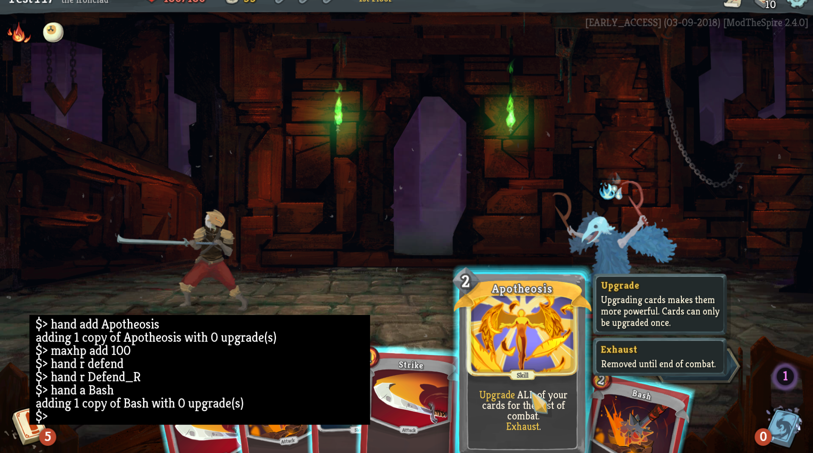

# BaseMod #
BaseMod 提供了许多钩子和一个控制台。

## 要求 ##
#### 一般使用 ####
* **Java 8（不要使用 Java 9 - ModTheSpire 不在 Java 9 上工作）**
* ModTheSpire v3.1.0+ (https://github.com/kiooeht/ModTheSpire/releases)

#### 开发 ####
* Java 8
* Maven
* ModTheSpire (https://github.com/kiooeht/ModTheSpire)

## 构建 ##
1. （如果尚未进行） `mvn install` ModTheSpire 或者修改 pom.xml 指向本地的 JAR 副本。
2. 从你的《杀戮尖塔》文件夹中复制 `desktop-1.0.jar` 到相对于仓库的 `../lib` 目录中。
3. 运行 `mvn package`

## 安装 ##
1. 将 `target/BaseMod.jar` 复制到你的 ModTheSpire mods 目录中。如果你的 mods 目录位于相对于仓库的 `../_ModTheSpire/mods` 位置，Maven 将会在打包后自动执行此操作。

# 维基
查看维基 (https://github.com/Linzeyo/BaseMod/wiki) 以开始使用 BaseMod 作为控制台或 modding 平台！

## 控制台 ##
查看维基上的控制台页面 (https://github.com/Linzeyo/BaseMod/wiki/Console) 以开始使用控制台进行测试！

## 已知问题 ##
* 如果你在与尼奥（Neow）同在的起始房间中使用控制台 `fight` 一名敌人或生成一个 `event`，你的存档将无法加载。请避免在离开起始房间之前使用这些命令。
* 如果你使用 `event` 命令并输入无效的 ID，游戏将会崩溃。
* BaseMod 在每周补丁发布时可能会出问题。这意味着如果在周四或周五时，事情突然不工作了，你可能需要等待一两天直到 BaseMod 的更新版本发布 :)

## 路线图 ##
* 跟上每周补丁的步伐以保持 mod 可用
* 为 mod 提供更多工具/更直观的工具以创建自定义 UI
* 有功能请求吗？创建一个 issue: (https://github.com/Linzeyo/BaseMod/issues)

## 对于 Modders ##

### 钩子 ###
查看此处了解可用的钩子 (https://github.com/Linzeyo/BaseMod/wiki/Hooks)

### Mod 徽章 ###
查看此处了解如何设置 Mod 徽章 (https://github.com/Linzeyo/BaseMod/wiki/Mod-Badges)